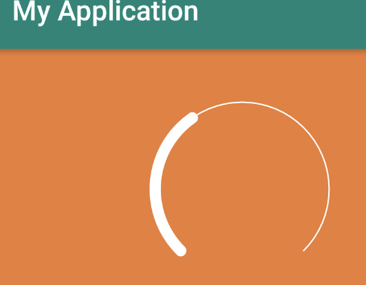
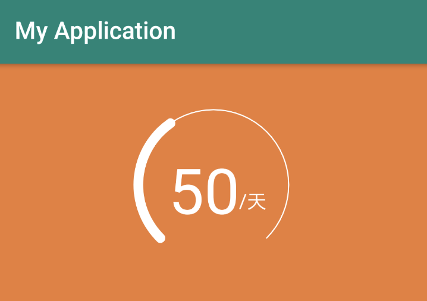

## 圆弧形状的进度展示View
效果图如下：


实现效果图：


1.首先进行圆弧画笔的初始化：

```
   mPaintArc = new Paint(Paint.ANTI_ALIAS_FLAG);
   mPaintArc.setStrokeWidth(mOutSideWidth);
   mPaintArc.setColor(mOutSideColor);
   //设置线冒样式 圆形的弧度
   mPaintArc.setStrokeCap(Paint.Cap.ROUND);
   //设置线段结合处为圆弧
   mPaintArc.setStrokeJoin(Paint.Join.ROUND);
   //进行描边声明
   mPaintArc.setStyle(Paint.Style.STROKE);
```

 2.画笔初始化后，就需要进行绘制圆弧绘制，绘制圆弧需要调用

> drawArc(@NonNull RectF oval, float startAngle, float sweepAngle, boolean useCenter, @NonNull Paint paint)
```
一共是五个参数：
 1.RectF oval          圆弧外切长方形的定义
 2.float startAngle    圆弧绘制的起始角度 
 3.float sweepAngle    圆弧绘制的度数，也就是从起始角度开始起增长的角度
 4.boolean useCenter   是否包含圆心
 5.Paint paint         圆弧的画笔，也就是上面定义的画笔
```
定义外切长方形RectF,就需要onMeasure进行对控件的长宽进行测量：
```
protected void onMeasure(int widthMeasureSpec, int heightMeasureSpec) {
   super.onMeasure(widthMeasureSpec, heightMeasureSpec);
   mWidth = MeasureSpec.getSize(widthMeasureSpec);
   mHeight = MeasureSpec.getSize(heightMeasureSpec);
   int padding = mContext.getResources().getDimensionPixelOffset(R.dimen.padding);
   //mProgressWidth:进度条圆弧的宽度   padding:定义圆弧距离外切长方形的值  
   rectArc.set(mProgressWidth+ padding,mProgressWidth+ padding,mWidth-mProgressWidth -padding,mHeight-mProgressWidth -padding);
 }   
```
3.进行测量后，以及外切长方形定义成功后，即可在ondraw()中绘制进度圆弧：
```
 private void drawArc(Canvas canvas) {
   mPaintArc.setStrokeWidth(mOutSideWidth);
   mPaintArc.setColor(mOutSideColor);
   canvas.drawArc(rectArc,startAngle,sweepAngle,false,mPaintArc);
   mPaintArc.setStrokeWidth(mProgressWidth);
   mPaintArc.setColor(mProgressColor);
   canvas.drawArc(rectArc,startAngle,100,false,mPaintArc);

  }
```
绘制后的效果：



4.绘制完圆弧就要绘制中间的文本展示，此时就需要测量左侧天数文本的宽度和右侧单位的宽度：
```
     mTextPaint.setColor(mProgressTextColor);
     mTextPaint.setTextSize(mProgressTextSize);
     String currentProgress = String.valueOf(mCurrentValue);
     //通过画笔paint 中提供getTextBounds 测量当前进度文本以及单位文本的宽高用于锁定文本的位置
     mTextPaint.getTextBounds(currentProgress,0,currentProgress.length(),rectProgress);
     canvas.drawText(currentProgress,centerX - rectProgress.width() / 2 - rectDes.width() /2,centerY  + rectProgress.height() / 2 ,mTextPaint);
```
绘制完文本效果：



5.绘制已经完成，接下来就是让进度和数字进行动态效果，此时就需要考虑动画的植入：
```
 //进行弧度动画的展示，并进行界面的刷新
 private void startAnim(int duration, int currentValue, final int currentAngle) {
        ValueAnimator valueAnimator = ValueAnimator.ofFloat(lastAngle, currentAngle);
        valueAnimator.setDuration(duration);
        valueAnimator.setTarget(mCurrentAngle);
        valueAnimator.addUpdateListener(new ValueAnimator.AnimatorUpdateListener() {
            @Override
            public void onAnimationUpdate(ValueAnimator animation) {
                mCurrentAngle = ((float) animation.getAnimatedValue());
                postInvalidate();
            }

        });
    }
```
6.到此步骤效果基本上就全部实现了，此时就只需要暴露出一个供外部调用改变进度的方法：
```
 public void setProgress(int currentValue){
        if(currentValue > mMaxProgress){
            Toast.makeText(mContext,"数值超出范围",Toast.LENGTH_LONG).show();
            return;
        }
        int currentAngle = ((int) ((currentValue * 1.0 / mMaxProgress) * sweepAngle));
        lastAngle = mCurrentAngle;
        startAnim(100,currentValue,currentAngle);
    }
```
##### 此时，外部通过调用setProgress传入当前的进度就可以完全实现进度动态的展示


